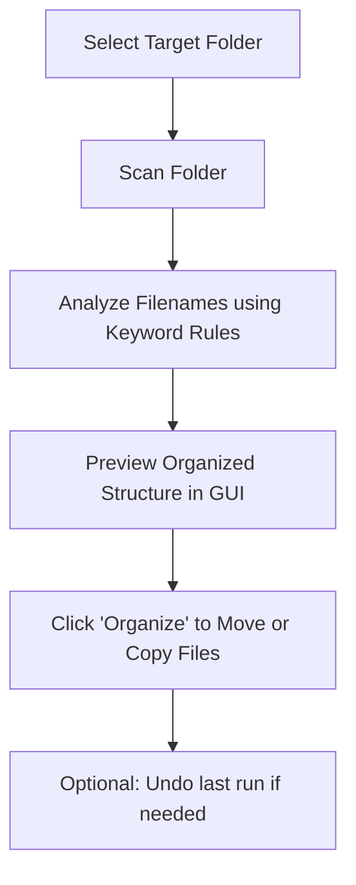

# The Organizer (Drum Kit Organizer)

A premium desktop application designed for music producers and sound designers to organize unorganized folders of audio samples (one-shots) into clean, categorized directories. 

Developed by **357 Studio Solutions**.

---

## Features

- **Automatic Audio Classification**: Classifies common audio file formats (`.wav`, `.mp3`, `.ogg`, `.flac`, `.aif`/`.aiff`, `.m4a`) into standard categories (Kicks, Snares, Claps, Hi-Hats, Toms, Cymbals, Bass & 808s, Vocals, FX, Melodics, and Percussion).
- **Custom Rule Editor**: Configure your own keyword rules for matches. Changes apply instantly in-memory.
- **Two Layout Options**:
  - **In-Place**: Creates category folders inside each individual subdirectory (e.g., `MyKit/Kicks/`, `MyKit/Snares/`).
  - **Consolidated**: Extracts and groups all samples from all directories directly under the main folder by category (e.g., `MainFolder/Kicks/`, `MainFolder/Snares/`), automatically prefixing filenames to retain kit context and prevent name collisions.
- **Safe Copy Mode**: Choose between copy mode (creates copies, leaving originals untouched) and move mode (reorganizes the files on disk).
- **One-Click Undo**: Made a mistake? Undo your last organization or folder export run in one click.
- **Modern Dark Theme UI**: Built with a sleek, immersive dark user interface.

---

## How It Works



---

## Getting Started

### Prerequisites

- **Python 3.8+**
- **Tkinter** (usually pre-installed with Python on Windows/macOS)

### Running the Application

1. Clone or download this repository to your computer.
2. Navigate to the project folder and run the application:
   ```bash
   python app.py
   ```

---

## Customizing Rules

You can change keyword matches by expanding the **"Custom Keyword Categories & Matching Rules"** section in the app. Enter comma-separated keywords for each category. For example:
- **Kicks**: `kick, kik, bd`
- **Snares**: `snare, snr, sd`
- **Hi-Hats**: `hat, hihat, hh, oh, ch, openhat, closedhat`

Click **"Save Rules & Apply"** to immediately re-categorize your current scanned list in the GUI.

---

## License

This project is open-source and free to use. Refer to the files for details.
